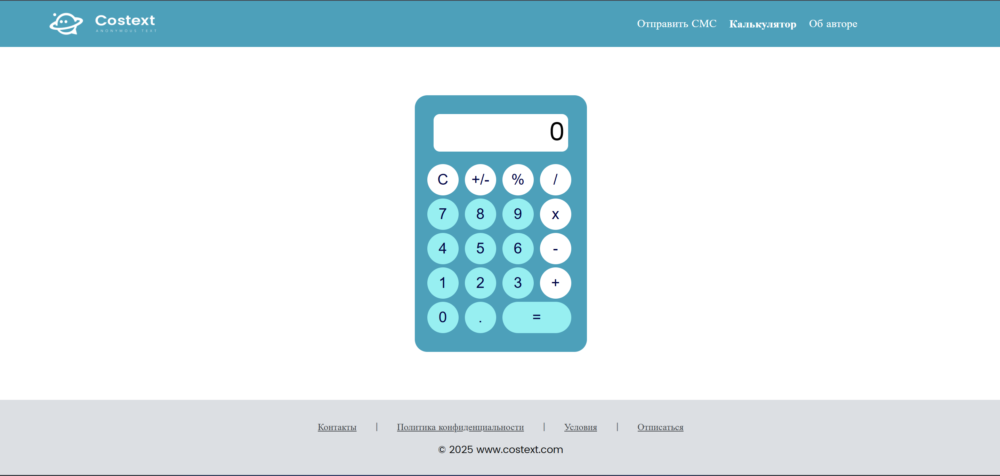
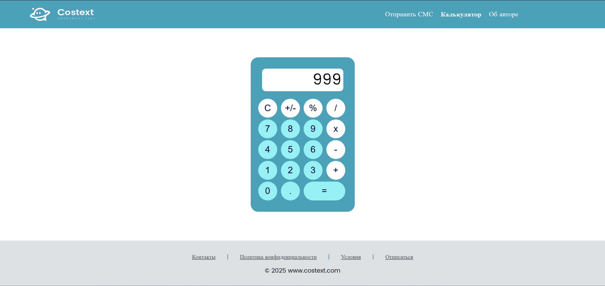
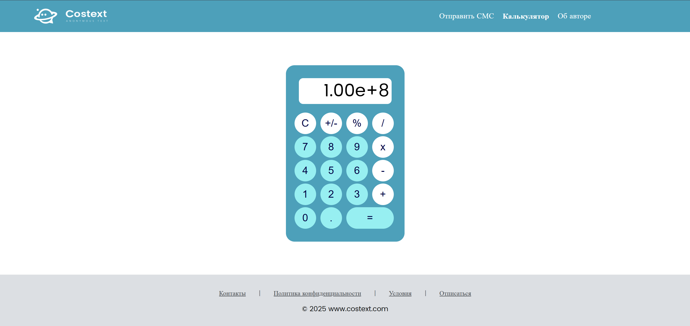

# Лабораторная работа 2: Калькулятор. Javascript
# Содержание

* [Цель работы](#цель-работы)
* [Задание](#задание)
    * [Основное задание](#основное-задание)
    * [Задание по вариантам](#задание-по-вариантам)
    * [Дополнительные задания](#дополнительные-задания)

## Цель работы
Цель данной лабораторной работы - знакомство с инструментами построения пользовательских интерфейсов web-сайтов: HTML, CSS, JavaScript. В ходе выполнения работы, вам предстоит продолжить реализовывать простой калькулятор, и затем выполнить задания по варианту.

## Задание
## Основное задание
Задание: Создание сайта с внедрением калькулятора. Верстка на HTML, CSS.
План:
1. Программирование логики с помощью JavaScript
2. Доступ к HTML-элементам из JavaScript
3. Программирование кнопок калькулятора
4. Запуск калькулятора с помощью LiveServer
5. Задание

Сайт, с которого был взят дизайн: https://www.costext.com/

## Задание по вариантам

Запрограммируйте операцию смены знака +/-;

```js
document.getElementById("btn_op_sign").onclick = function() {
    if (!selectedOperation) {
        if (a != '') {
            a = (parseFloat(a) * -1).toString();
            outputElement.innerHTML = a;
        }
    } else {
        if (b != '') {
            b = (parseFloat(b) * -1).toString();
            outputElement.innerHTML = b;
        }
    }
}
```



После нажатия кнопки:


## Дополнительное задание

1. Ограничить ввод чисел в калькулятор до 8 чисел, если привысит, поменять вид на экспоненциальный

```js
    let finalResult = res.toString();
    if (finalResult.length > 8) {
        finalResult = res.toPrecision(7).toString();

        if (finalResult.includes('.')) {
            finalResult = parseFloat(finalResult).toString();
        }

        if (finalResult.length > 8) {
            finalResult = finalResult.substring(0, 8);
        }
    }
```

