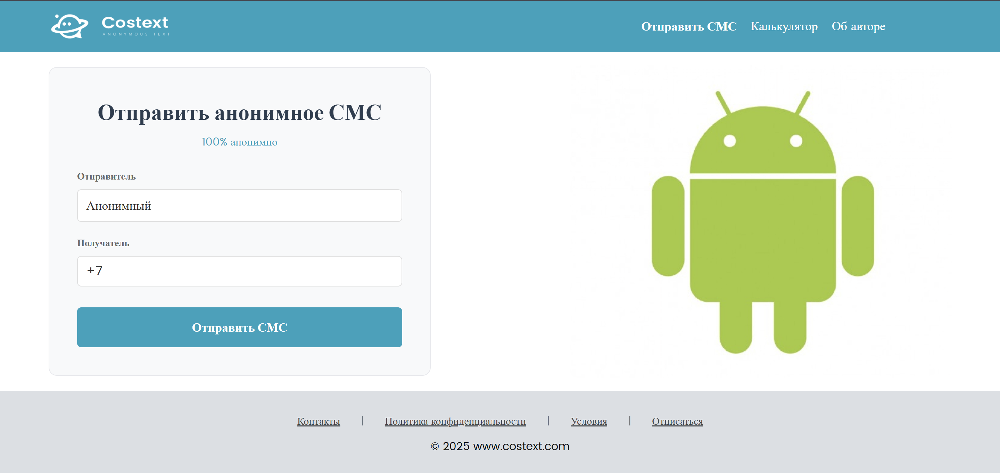
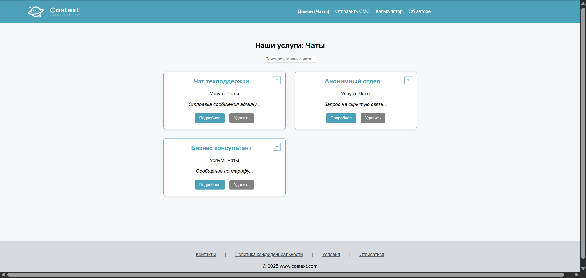
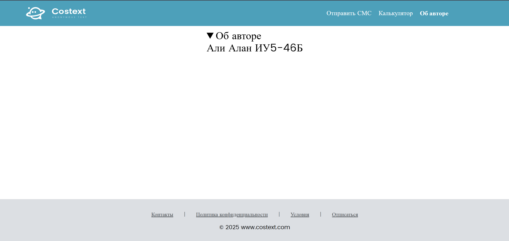

# Лабораторная работа 3: Простое веб-приложение. Верстка

# Содержание

* [Цель работы](#цель-работы)
* [Задание](#задание)
    * [Основное задание](#основное-задание)
    * [Дополнительные задания](#дополнительные-задания)

## Цель работы
Цель данной лабораторной работы - знакомство с node, npm, написание простого приложения на JavaScript. В ходе выполнения работы, вам предстоит ознакомиться с кодом реализации простого интерфейса и вывода данных, и затем выполнить задания по варианту.

## Задание
## Основное задание
Задание: Создание сайта с внедрением калькулятора. Верстка на HTML, CSS.
План:
1. Инструменты
2. Что такое node, npm и package.json
3. Как работать с html в JS
4. Инициализация проекта
5. Создание главной страницы, подключение bootstrap
6. Простая кнопка на JavaScript
7. Структурирование проекта
8. Верстка главной страницы
9. Верстка страницы продукта


Сайт, с которого был взят дизайн: https://www.costext.com/

## Дополнительное задание

1. Поменяйте цветовую палитру калькулятора с оранжево-серой на любую другую
```css
    background: #77f2f2;
    color: #01064a;
```

2. Поменять значок курсора на запрещающий при наведении на ссылки в футере
```css
.info a {
    color: #43484d;
    font-size: 15px;
    text-decoration: underline;
    cursor: not-allowed;
}
```
3. Сделать всплывающей вкладку об информации об авторе
```html
<main class="main-content">
        <div class="author-info">
            <details class="author-text"> <summary class="author-head-text">Об авторе</summary> Али Алан ИУ5-46Б </details>
        </div>
</main>
```

